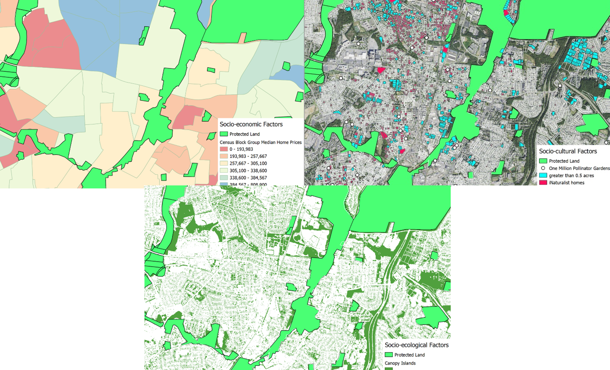

Ideally we could convince every homeowner in the country to ecologically landscape to achieve socio-ecological goals. But realistically, we cannot reach every homeowner. Current outreach events such as presentations in which individuals must “show up”, filter out the people outreach would benefit the most. The outcome of this is a scatter of ecologically landscaped properties spatially clumped due to socioeconomic factors. This is not socially or ecologically beneficial. Recent work shows home gardens increase connectivity and create residential corridors for wildlife. Prioritization of residential addresses that create corridors between green spaces would allow for proactive outreach…but where are the best homes?
  
Here, we use publicly available data about privately owned parcels to create a map of existing ecologically managed homes and potential residences that would benefit from ecological landscaping outreach. We layer ecological landcover data, socioeconomic data, and personal interest indicators to create a resistance surface through which we will conduct connectivity analyses. Eventually we aim to create a web portal that will reveal if a particular address is part of that corridor.

  

