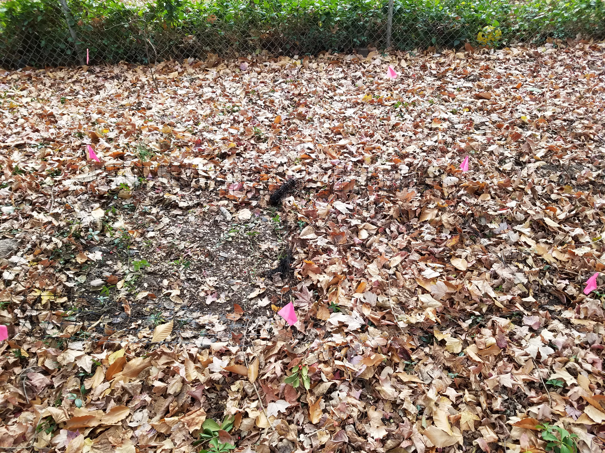
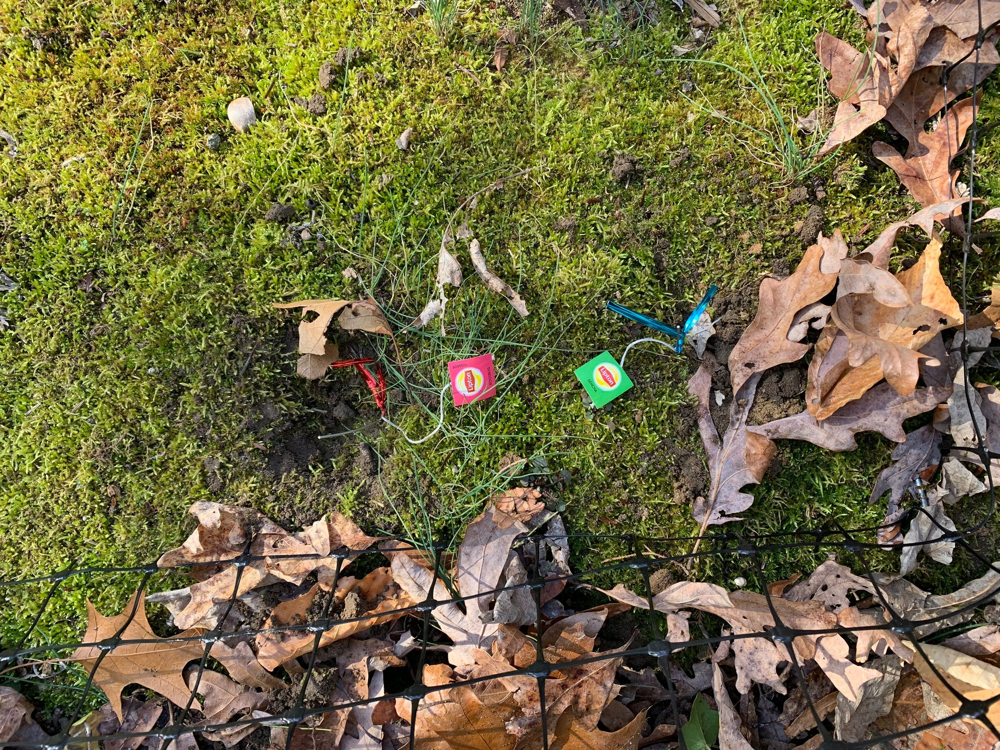

The EPA (2020) estimates that 35 million tons of leaf litter are removed from residential yards each year. In some yards, this disturbance occurs for decades. In this study, we investigate if long-term litter removal affects soil carbon and decomposition. Then we explore if these effects persist after litter removal has ceased. 
  

We used Lipton teabags as makeshift litter bags to study the decomposition rate in areas where litter was removed or retained. We weighed the teabags before and after burying them in the ground. This allowed us to measure the amount of mass that was lost. We also measured the amount of soil carbon from samples we took in each litter management area.

  

Stay tuned for a publication!