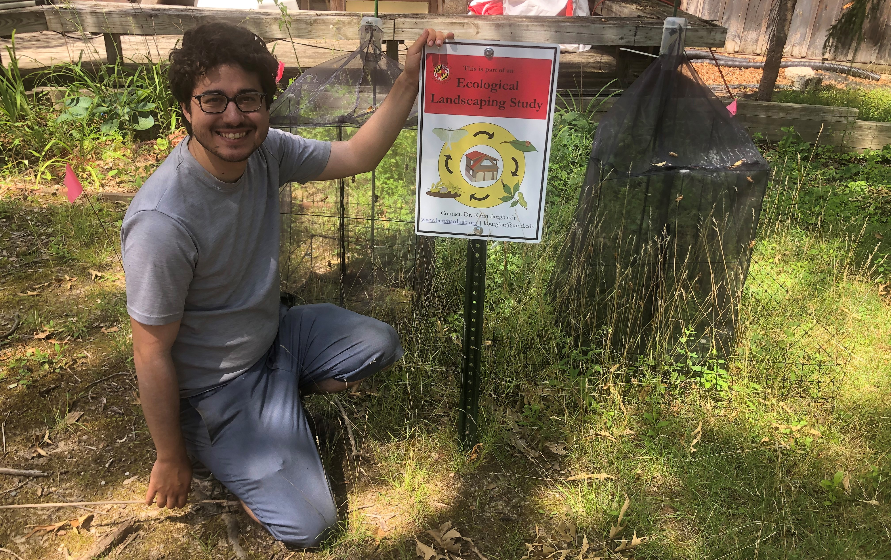
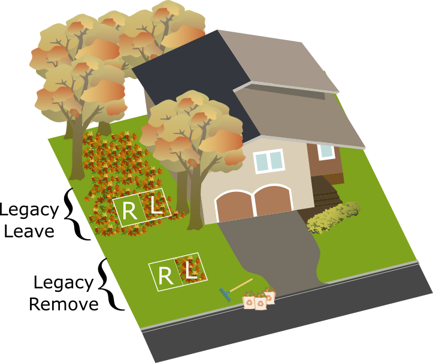
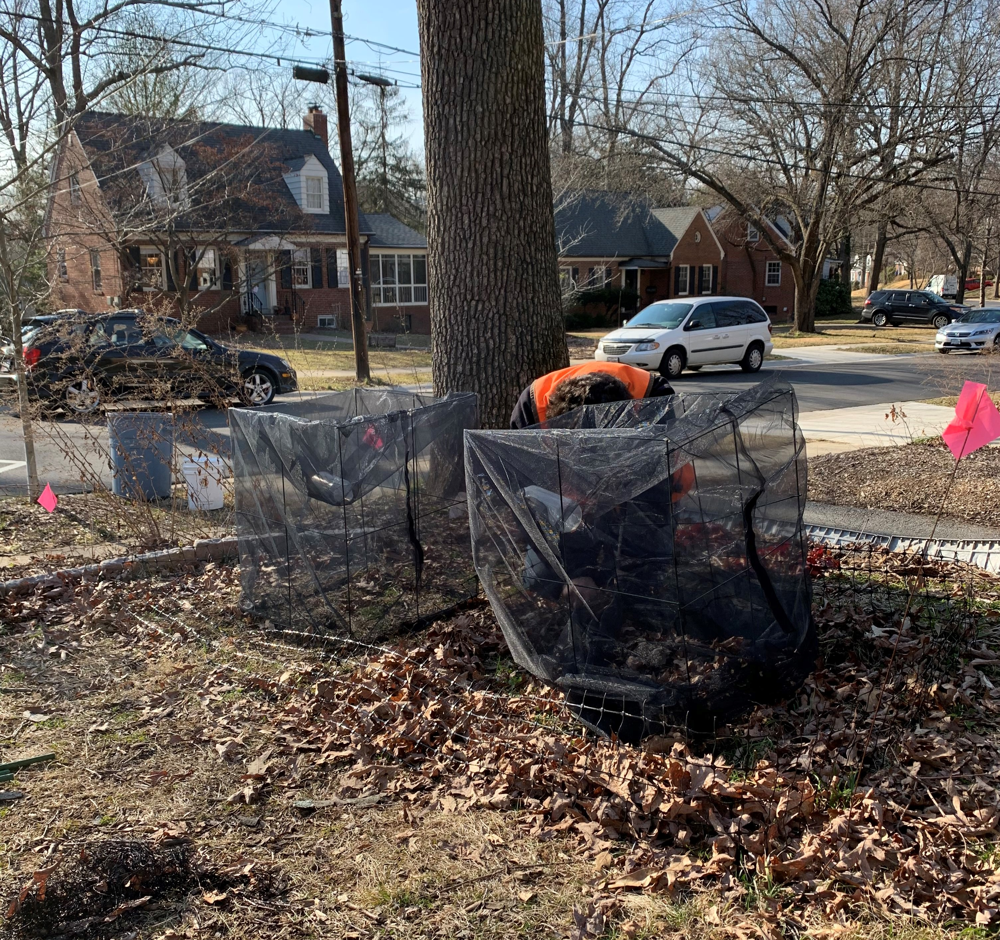

Residential landscaping can benefit native wildlife if ecologically friendly management techniques are utilized. For example, retaining autumn leaf litter is a commonly discussed method to protect overwintering beneficial insects like pollinators and natural enemies. However, there has been no actual research on this management technique. We know little about where these insects overwinter, when they emerge, or how far they travel to new sites. Some may overwinter directly in the leaf litter, while others overwinter inches deep into the soil. Some may emerge in early spring, while others emerge in June. Learning the life history of beneficial insects will help us protect them. Understanding the local conditions that overwintering insects desire will allow homeowners to create habitat and knowing the phenology of insects will help us time yard work to be least disturbing.   
        
  
I worked with 20 homeowners between D.C and Baltimore to try and answer these questions. Homeowner yards were divided into sections based on the legacy of leaf litter management. An area where leaf litter was retained for a number of years was a “Leave Legacy” whereas an area where litter was removed year after year was a “Remove Legacy”. I created adjacent 1x1m plots within each of those sections. In November after leaf-fall, I either retained or removed leaf litter from the plots. In the spring, emergence traps were installed on top of each plot. I collected from the traps every ten days. 
  
  
  
This experimental design allows me to compare the long term legacy effects of removing leaf litter with a single year of litter manipulations. Legacy effects generally impact soil but changing soil conditions could have an impact on overwintering insects which may prefer less disturbed soil. Does changing litter management habits for one year restore habitat enough to show a difference in overwintering insect emergence? This study will let me find out. The legacy area also gives me a larger treatment area than a 1m plot of litter manipulations in case the scale of disturbance matters to insects searching for an overwintering location. 
